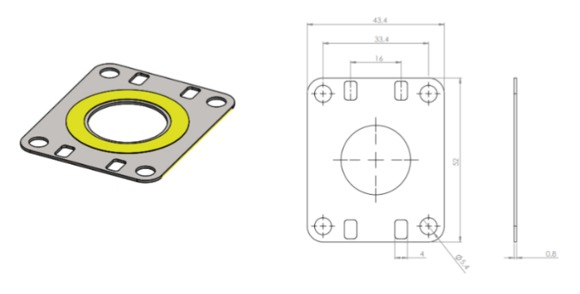
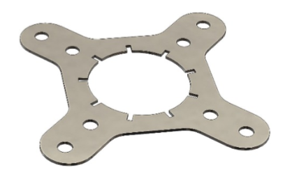

R-IoT Sensor
============

R-IoT Sensor is an exceptionally versatile,
ultra-low power radar sensor designed for
LoRaWAN. It's well-suited for a multitude
of applications, including detecting
presence, measuring distance to objects,
and determining levels in tanks, as well
as assessing snow depth.

It captures the intensity of the radar
signal reflected from various distances,
processes the data, and reports the
findings based on set parameters. Puck
Radar comes equipped with multiple methods
tailored for common scenarios adaptable
for a broad range of applications such as
parking, waste management, silo & septic
tank levels, distance metering, seat
occupancy or snow level metering.

R-IoT Sensor sensor can be ordered with two
different housings, supporting different
user needs. R-IoT Sensor Standard lens
housing: The radar will detect
objects/levels within an approx. +/- 60 °
angle. R-IoT Sensor Narrow lens housing: The
radar will detect objects/levels within an
approx. +/- 30 ° angle.

.. rubric:: Benefits & Use
   Cases\ `​ <#benefits--use-cases>`__
   :name: benefits--use-cases
   :class: anchor anchorWithStickyNavbar_JTJE

The compact cylindrical format, weather
resistance (IP67), long battery life,
LoRaWAN long range connectivity, up to 6.8
m radar range and mm accuracy open a wide
range of applications for R-IoT Sensor
including:

-  Parking space occupancy: Preferably
   installed 10-300 cm above the ground,
   either in front of or above a parking
   spot.
-  Distance/Level Metering: Monitoring
   containers, silos, wells, trash bins,
   septic tanks, cesspits, water levels &
   more.
-  Snow Level Meter: Provides accurate,
   reliable readings under various
   environmental conditions.
-  Seat Occupancy detection: Efficiently
   determines the occupancy status of
   seats or desks.

Several predefined methods for operating
the radar and analyzing the results are
included as standard in Puck Radar. Each
method can be configured for different use
case specifics.

.. rubric:: Radar method
   description\ `​ <#radar-method-description>`__
   :name: radar-method-description
   :class: anchor anchorWithStickyNavbar_JTJE

The Puck Radar offers a suite of
pre-defined and customizable radar
techniques suited for various
applications, detailed as follows:

| **Closest Object Detection**
| This method pinpoints the nearest object
   that reflects a signal surpassing a
   preset amplitude threshold within a
   defined measurement range.

| **Farthest Object Detection**
| It identifies the most distant object
   exceeding a specific reflection
   amplitude threshold, also within a
   predetermined measurement range.

| **Largest Reflection Detection**
| This technique detects the object that
   produces the most significant reflection
   echo within the designated measurement
   distance.

These techniques are versatile, catering
to diverse use cases supported by the
methods below.

| **Parking Monitoring**
| *Technique Used:* Largest Reflection
   Detection
| *Functionality:* Identifies objects
   within a specified distance, indicating
   the occupancy status
   (occupied/unoccupied), along with the
   distance and echo amplitude from the
   detected object. While particularly
   useful for parking monitoring, this
   technique is also applicable for level
   detection in user scenarios where the
   strongest echo likely indicates the
   level in container or tank.
| *Battery Life:* Tailored for up to
   10-year battery lifespan with a sensor
   scan interval of 30 seconds for parking
   use cases, and extendable beyond 10
   years for user scenarios permitting
   longer scan intervals.

| **Well Level Measurement**
| *Technique Used:* Farthest Object
   Detection
| Functionality: Accurately measures the
   distance to the water level in a well
   and the amplitude of the radar echo,
   ideal for use cases where the most
   distant echo above the amplitude
   threshold represents the level to be
   measured.
| *Battery Life:* Designed to last up to
   10 years of battery life with a
   10-minute sensor scan cycle.

| **Garbage Bin Fill Level**
| Technique Used: Closest Object Detection
| *Functionality*: Offers adjustable
   sensitivity to either detect or ignore
   lightweight material close to the
   sensor, providing both distance and echo
   amplitude data.
| *Battery Life:* Designed to last up to
   10 years with a scanning interval of
   every 10 minutes.

| **Seat Occupancy Detection**
| Technique Used: Closest Object Detection
| *Functionality:* Efficiently measures
   and reports occupancy status.
| *Battery Life:* Achieves up to 7 years
   of battery life with a 30-second
   scanning interval.

These methods provide a comprehensive
overview of the R-IoT Sensor's capabilities,
demonstrating its adaptability across
various use cases and emphasizing
operational efficiency alongside extended
battery life.

**Noise Reduction and Customizable
Settings**

To further enhance performance and tailor
R-IoT Sensor to different measurement
environments, noise, and unwanted signals
from moving objects can be reduced through
averaging. This helps to stabilize
measurement results and improves the
reliability of detected signals. Users can
also customize the measurement range,
sensitivity, and threshold settings to
fine-tune the radar's response based on
specific needs and environmental
conditions. These adjustable options allow
for a tailored configuration that
optimizes both accuracy and efficiency for
each unique use case.

|image9|
*Figure 1: Explode view of R-IoT Sensor with
standard lens*

R-IoT Sensor's housing is composed of two
plastic components, complemented by a
rubber O-ring for enhanced sealing. The
device features a user-replaceable
battery, with additional batteries
available for purchase separately.

R-IoT Sensor is available in two versions.
R-IoT Sensor Standard lens with an approx.
+/- 60° radar width suitable for
applications covering a wider area. R-IoT Sensor 
Narrow lens with an approx. +/- 30°
radar width suitable for applications
where a more focused radar beam is better
suited.

|image10|
*Figure 2: R-IoT Sensor housings with
Standard (left) & Narrow (right) lense.
Actual radar sensor marked witha red dot
and a red triangle indicating the radar
beam width*

.. rubric:: Software\ `​ <#software>`__
   :name: software
   :class: anchor anchorWithStickyNavbar_JTJE

R-IoT Sensor from SweIoT is equipped with
a sophisticated software architecture that
includes a Virtual Sensing Machine (VSM)
embedded in its firmware. This VSM
executes specialized sensor applications
designed for the device's sensing
capabilities and specific use cases.

For more specialized requirements,
SweIoT provides tailored application
and radar method development through its
expert engineering services. This
customization enables R-IoT Sensor to be
precisely adapted to meet unique needs,
thereby significantly enhancing its
performance in a variety of specialized
settings.

.. rubric:: Getting
   started\ `​ <#getting-started>`__
   :name: getting-started
   :class: anchor anchorWithStickyNavbar_JTJE

.. rubric:: Initial Setup & Activation
   (OTAA)\ `​ <#initial-setup--activation-otaa>`__
   :name: initial-setup--activation-otaa
   :class: anchor anchorWithStickyNavbar_JTJE

Pre-Activation Steps:

#. Prior to activating the device, ensure
   it is registered on the designated
   LoRaWAN server.
#. Utilize the Dev EUI and Network Key
   provided with your digital delivery
   information for registration.

Activation:

#. Following registration, briefly bring
   any NFC reader close to the device to
   initiate activation. Most mobile phones
   are equipped to serve as NFC readers.
#. The activation process might take up to
   two minutes. Successful join activity
   will be indicated on the LoRaWAN
   Network Server.
#. The device will continuously attempt
   the activation process until it
   successfully connects to the registered
   LoRaWAN network. Joining the network
   might take up to 24 hours once the
   LoRaWAN network becomes available.

.. rubric:: Installation\ `​ <#installation>`__
   :name: installation
   :class: anchor anchorWithStickyNavbar_JTJE

Effectiveness of the R-IoT Sensor
would be compromised by dirt, water, or
any physical barriers in its path. Choose
a mounting location that minimizes these
obstructions. As a wireless device, R-IoT Sensor 
should not be encased or shielded by
metal, as this will impact its wireless
range.

.. rubric:: Adhesive\ `​ <#adhesive>`__
   :name: adhesive
   :class: anchor anchorWithStickyNavbar_JTJE

The provided adhesive is suitable for
attaching the device to smooth, dry
surfaces such as metal or plastic. Avoid
applying the adhesive on oily or cold
surfaces (below 5°C). For optimal
adhesion, clean the surfaces with a
mixture of isopropyl alcohol (IPA) and
water (about 50% to 70% IPA) before using
the adhesive.

.. rubric:: Mounting
   Plates\ `​ <#mounting-plates>`__
   :name: mounting-plates
   :class: anchor anchorWithStickyNavbar_JTJE

For enhanced installation flexibility, the
device comes with a mounting plate that
can accommodate both screw and cable tie
attachments. This accessory allows for
versatile positioning, enabling the plate
to be securely attached to either the back
or front of the device using the provided
yellow adhesive. It is important to
correctly position the R-IoT Sensor at the center
of the plate for optimal functionality.
The design of this mounting system ensures
a secure and convenient installation in
various locations and orientations,
adapting seamlessly to the unique needs of
your application.

|image11|
*Figure 3: R-IoT Sensor Mounting plate with
mounted adhesive.*

.. rubric:: Flush
   Mounting\ `​ <#flush-mounting>`__
   :name: flush-mounting
   :class: anchor anchorWithStickyNavbar_JTJE

R-IoT Sensor can also be discreetly
integrated into walls or ceilings through
flush mounting. This requires a 45 mm
diameter hole for the sensor, ensuring an
unobtrusive and aesthetically appealing
installation. Note that battery
replacement may be challenging with
flush-mounted devices.

.. rubric:: Step-by-Step flush mounting
   installation:`​ <#step-by-step-flush-mounting-installation>`__
   :name: step-by-step-flush-mounting-installation
   :class: anchor anchorWithStickyNavbar_JTJE

#. **Selecting the Location:** Identify a
   clear area that aligns with your
   monitoring objectives. The sensor
   should be oriented correctly to direct
   the radar beam towards the target.
#. **Drilling the Hole:** Drill a 45 mm
   diameter hole at the chosen spot.
   Ensure the hole is clean and free of
   debris.
#. **Installing the Sensor:** Apply a
   thick layer of sealant at the bottom of
   the drilled hole. Place the sensor with
   its back (label side) downwards in the
   hole, ensuring it remains correctly
   positioned while the sealant sets.
   Avoid applying glue or sealant on the
   sensor's lid to ease future battery
   replacements. Remember that any glue or
   sealant on the top of the radar lid
   could affect the sensor's performance.
#. **Adding a Cover Plate:** For aesthetic
   purposes, a plastic cover plate can be
   installed to conceal the sensor. The
   cover plate should not contain glass,
   metal, or carbon as it will
   significantly reduce the radar
   performance and range. It may be wise
   to verify that the radar performance
   before a cover plate is permanently
   installed. The mounting plate in figure
   3 can also be used.

.. rubric:: Operations\ `​ <#operations>`__
   :name: operations
   :class: anchor anchorWithStickyNavbar_JTJE

As the R-IoT Sensor device accumulates
operational time, you may find
opportunities to enhance its reporting
accuracy or battery efficiency. The device
can be configured to best suit your
specific use case while ensuring prolonged
battery life.

Key configuration options include:

#. Radar Method: Choose from Well, Bin,
   Parking, or Seating, each tailored for
   specific scenarios. Detailed
   descriptions of these methods are
   provided below.
#. Radar Measurement Cycle: Adjusting the
   cycle length can extend battery life.
   Longer cycles lead to less frequent
   measurements but improved battery
   longevity.
#. Radar Range: Configure the starting
   point and length of the radar's range.
   This customization can improve
   measurement accuracy and conserve
   battery power.
#. Number of Radar Pulses per Measurement:
   This setting is crucial for detecting
   stationary objects in challenging
   environments, such as in streaming
   water. Note that increasing the number
   of pulses may decrease battery life.
#. Radar Sensitivity or Threshold: Adjust
   the radar's sensitivity and/or
   threshold to balance between detection
   accuracy and potential false triggers.
#. Sensor Reporting Type: Choose between
   periodic reporting or reporting based
   on value or state changes. This
   selection depends on your need for
   real-time data versus battery
   conservation.
#. Configuration of other built-in
   sensors: Tailor the settings to align
   with your specific requirements.

.. rubric:: Battery
   replacement\ `​ <#battery-replacement>`__
   :name: battery-replacement
   :class: anchor anchorWithStickyNavbar_JTJE

To access the battery, rotate the lid
counterclockwise; to close and secure it
after maintenance, rotate it clockwise for
about a quarter turn. It's vital to
replace and correctly install both the
rubber cushion and the O-ring to ensure
the device's optimal functionality and
waterproof integrity.

Use a Star tool at each end of the R-IoT 
Sensor to apply the necessary torque for
fully tightening the lid, thus maintaining
its waterproof seal.

For comprehensive maintenance, battery
replacement kits are available. These kits
include replacement batteries, Star tools,
new O-rings, and rubber cushions to ensure
a complete and proper maintenance process.

|image12|
*Figure 4: Star tool*

**Never try to open or close the R-IoT 
Sensor housing with any other tools as you
may destroy the housing or fail to
correctly close the unit.**

.. rubric:: Miscellaneous\ `​ <#miscellaneous>`__
   :name: miscellaneous
   :class: anchor anchorWithStickyNavbar_JTJE

When deploying the R-IoT Sensor in diverse
use cases and environments, several
factors should be taken into account for
optimal performance:

-  **Radar Beam:** The radar sensor
   detects objects within a beam lob of
   ±60°, reaching up to 6.8 meters. In
   many applications, using a narrow lens
   to reduce the radar lob to ±30° can be
   advantageous to minimize false echoes.
-  **Physical Environment:** It's crucial
   to carefully consider the sensor's
   mounting location. Assess if
   modifications to the physical
   environment can help reduce unwanted
   radar echoes from surrounding objects.
-  **Radar Reflection:** Different
   materials reflect radar waves
   differently. Dense materials like
   metal, glass, and water are strong
   reflectors. Conversely, materials such
   as paper, plastics, cloth, and human
   tissue offer weaker reflections but are
   still detectable by the radar sensor.
   The size and shape of the reflecting
   object also influence the amplitude of
   the reflected signal. Larger, flat, and
   orthogonal surfaces reflect more radar
   waves than smaller, uneven, or tilted
   surfaces.
-  **Signal Averaging:** Averaging the
   radar signal can help reduce noise in
   measurements or mitigate the influence
   of moving objects. Increasing the
   number of samples in each radar burst
   can enhance sensitivity, particularly
   if the target object remains stationary
   during measurement. However, if the
   target object is in motion (like
   streaming water, human tissue, or a
   fluttering object), reducing the number
   of averaging samples may be more
   effective.

Each of these considerations plays a
crucial role in the successful deployment
and operation of the R-IoT Sensor, ensuring
accurate measurements and reliable
performance in a variety of settings.

.. rubric:: Technical
   information\ `​ <#technical-information>`__
   :name: technical-information
   :class: anchor anchorWithStickyNavbar_JTJE

.. raw:: html

    <table>
      <tr>
        <th>Specification</th>
        <th>Description</th>
      </tr>
      <tr>
        <td>Features</td>
        <td>
          60 GHz pulsed coherent radar sensor. 
          Cloud-supported geo-positioning 
          Temperature sensor (Typical accuracy: +/- 2 °C at 0-30 °C) 
          Near field connectivity: NFC
        </td>
      </tr>
      <tr>
        <td>Radar specifications</td>
        <td>
          Acconeer XM122 radar module 
          60.5 GHz 
          EIRP: Max +10 dBm 
          0.3 - 6.8 m range with mm precision
        </td>
      </tr>
      <tr>
        <td>2.4 GHz protocol specifications</td>
        <td>
          2.4 GHz (2.4 -2.483 GHz) 
          Data rate: 2 Mbps 
          Max output power: 5.5 dBm 
          Sensitivity: -101 dBm (Long range)
        </td>
      </tr>
      <tr>
        <td>Dimensions</td>
        <td>
          <strong>R-IoT Sensor Std</strong> 
          - Diameter: 45 mm 
          - Height: 30 mm 
          - Weight incl battery: 38 g 
          - Radar beam (approx.): +/- 60° 
          - Radar Reference Point (RRP): 1.1 cm  
          <strong>R-IoT Sensor Narrow</strong> 
          - Diameter: 45 mm 
          - Height: 45 mm 
          - Weight incl battery: 43 g 
          - Radar beam (approx.): +/- 30° 
          - Radar Reference Point (RRP): 2.6 cm  
          The distance is measured from the radar RRP located 1.1 cm (Std) or 2.6 cm (Narrow) below the front of the sensor.
        </td>
      </tr>
      <tr>
        <td>Operating conditions</td>
        <td>
          -30 to + 80° C 
          Weather protected: IP67 
          Rubber ring sealing 
          Circuit boards moisture protected by conformal coating
        </td>
      </tr>
      <tr>
        <td>Storage conditions</td>
        <td>
          +10 to + 30° C
        </td>
      </tr>
      <tr>
        <td>Power supply</td>
        <td>
          Replaceable 2.1 Ah Li-SOCl2 battery. 3.6 V
        </td>
      </tr>
      <tr>
        <td>Battery life</td>
        <td>
          5-10 years battery life using default settings.
        </td>
      </tr>
      <tr>
        <td>Other</td>
        <td>
          * The device features battery voltage level monitoring capability. A voltage reading below 2.8 V (when the temperature exceeds +10°C) indicates that the battery should be replaced. 
          * Data memory for off-line storage of time-stamped data.
        </td>
      </tr>
    </table>

.. rubric:: Safety &
   Compliance\ `​ <#safety--compliance>`__
   :name: safety--compliance
   :class: anchor anchorWithStickyNavbar_JTJE

Puck Radar is equipped with a replaceable
primary Li-SOCl\ :sub:`2` (Lithium Thionyl
Chloride) battery. It is important to
dispose of this battery responsibly,
following recycling guidelines for
batteries.

When managing Li-SOCl\ :sub:`2` batteries,
it's imperative to proceed with caution
due to their sensitivity. Ensure to avoid
short-circuiting, puncturing, or
subjecting them to high temperatures. It
is especially crucial to prevent exposure
to temperatures above +80°C to safeguard
both your safety and the battery's optimal
performance longevity. Additionally,
refrain from detaching the battery
connector or severing the battery wire to
maintain the battery's integrity and
functionality.

**Note:** This equipment has been tested
and found to comply with the limits for a
Class B digital device, pursuant to part
15 of the FCC Rules. These limits are
designed to provide reasonable protection
against harmful interference in a
residential installation. This equipment
generates, uses and can radiate radio
frequency energy and, if not installed and
used in accordance with the instructions,
may cause harmful interference to radio
communications. However, there is no
guarantee that interference will not occur
in a particular installation. If this
equipment does cause harmful interference
to radio or television reception, which
can be determined by turning the equipment
off and on, the user is encouraged to try
to correct the interference by one or more
of the following measures:

-  Reorient or relocate the receiving
   antenna.
-  Increase the separation between the
   equipment and receiver.
-  Connect the equipment into an outlet on
   a circuit different from that to which
   the receiver is connected.
-  Consult the dealer or an experienced
   radio/TV technician for help

**FCC NOTICE (for USA):**

This device complies with Part 15 of the
FCC Rules. Operation is subject to the
following two conditions: (1) this device
may not cause harmful interference, and
(2) this device must accept any
interference received, including
interference that may cause undesired
operation. Federal Communication
Commission (FCC) Radiation Exposure
Statement: This equipment complies with
FCC radiation exposure limits set forth
for an uncontrolled environment. In order
to avoid the possibility of exceeding the
FCC radio frequency exposure limits, human
proximity to the antenna shall not be less
than 20cm (8 inches) during normal
operation. The antenna(s) used for this
transmitter must not be co-located or
operating in conjunction with any other
antenna or transmitter. No changes shall
be made to the equipment without the
Company’s permission as this may void the
user’s authority to operate the equipment.

**INDUSTRY CANADA STATEMENTS:**

This device complies with Industry Canada
licence exempt RSS standard(s). Operation
is subject to the following two
conditions: (1) this device may not cause
interference, and (2) this device must
accept any interference, including
interference that may cause undesired
operation of the device. This equipment
complies with the safety requirements for
RF exposure in accordance with RSS-102
§2.5.2. This equipment must be installed
and operated in accordance with the
provided instructions and a minimum 20 cm
spacing must be provided between the
antenna and any person’s body during
wireless modes of operation.

**INDUSTRY CANADA STATEMENTS:**

Cet appareil est conforme avec Industrie
Canada exempt de licence Rss standard(s).
Son fonctionnement est soumis aux deux
conditions suivantes : (1) cet appareil ne
peut causer d’interférences, et (2) cet
appareil doit accepter toute interférence,
y compris des interférences qui peuvent
provoquer un fonctionnement indésirable du
périphérique. Ce dispositife est conforme
à la norme de sécurité en matière
d’exposition RF conformé-ment à la RSS-102
§2.5.2. Ce dispositif doit être installé
et utilisé conformément aux instructions
fournies et à 20 cm espacement minimal
doit être prévu entre l’antenne et le
corps de toute personne pendant les modes
sans fil de fonctionnement.

**INDUSTRY CANADA NOTICE**

“This device complies with ISED’s
licence-exempt RSSs. Operation is subject
to the following two conditions: (1) This
device may not cause interference; and (2)
This device must accept any interference,
including interference that may cause
undesired operation of the device”

                          

